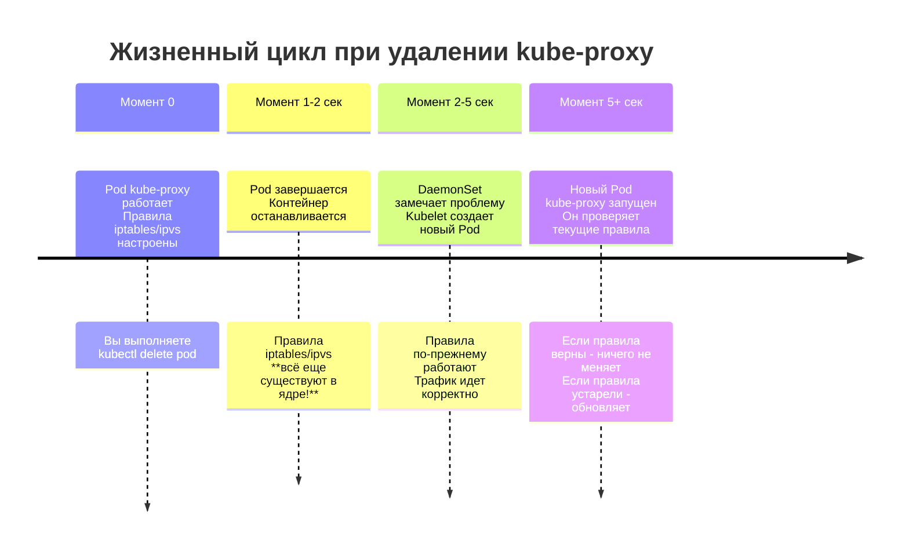

**kube-proxy** — это компонент **Data Plane** (плоскости данных) Kubernetes, который отвечает за реализацию сетевых правил на каждом узле (Node) кластера. Его основная задача — обеспечивать связность и балансировку трафика к сервисам (Services) как внутри кластера, так и снаружи.

Он не является прокси-сервером в классическом понимании (как Nginx или Envoy), через который проходит каждый пакет (хотя в одном из режимов работы он именно это и делает). Скорее, это менеджер правил, который говорит ядру Linux: *«Трафик, пришедший на этот IP, нужно перенаправить на один из этих подов»*.

Давай разберем его функции, режимы работы и устройство подробно.

---

### 1. Зачем нужен kube-proxy?

В Kubernetes Pod'ы динамичны: они появляются, исчезают, перемещаются по узлам. У них меняются IP-адреса. Если бы один Pod обращался к другому напрямую по его IP, при перезапуске Pod'а связь бы потерялась.

Для решения этой проблемы существуют **Service (сервисы)** — абстракция, которая представляет собой стабильную точку входа (виртуальный IP и имя DNS) для группы подов.

Вот тут и вступает в игру **kube-proxy**:
1.  **Наблюдение**: Он следит за изменениями в API-сервере (за добавлением/удалением Service и Pod'ов).
2.  **Создание правил**: Когда появляется новый Service, kube-proxy настраивает сетевые правила на узле, чтобы трафик, идущий на IP этого Service, попадал на один из реальных Pod'ов (Endpoint'ов).

### 2. Как работает? Режимы работы (Data Plane Modes)

kube-proxy поддерживает несколько режимов работы, которые определяют *как именно* будут создаваться эти правила.

#### Режим 1: `iptables` (стандартный и самый популярный)
Это режим по умолчанию в большинстве дистрибутивов.
*   **Как работает**: kube-proxy создает цепочки правил в `iptables` (и `ipvs` частично) на каждом узле.
*   **Механизм**:
    1.  Приходит пакет на узел по адресу `CLUSTER-IP:Port` сервиса.
    2.  Ядро перехватывает пакет, сверяясь с таблицами `iptables`.
    3.  Правило `iptables` (DNAT — Destination Network Address Translation) подменяет адрес назначения (ClusterIP) на адрес случайно выбранного пода из списка.
    4.  Пакет уходит в Pod.
    5.  Ответный пакет идет обратно, и `iptables` меняет обратно обратный адрес (чтобы клиент думал, что отвечает именно сервис).
*   **Плюсы**: Стабильно, надежно, работает на чистом ядре Linux без лишних процессов.
*   **Минусы**: При большом количестве сервисов (>1000) правила `iptables` становятся очень длинными, обновляются медленно и грузят CPU (так как `iptables` — это линейный список).

#### Режим 2: `ipvs` (рекомендуется для больших кластеров)
Переключив kube-proxy в режим IPVS, мы используем механизм LVS (Linux Virtual Server), встроенный в ядро.
*   **Как работает**: Использует таблицу хеширования (hash table) в ядре для принятия решений о балансировке, а не линейный список цепочек.
*   **Механизм**: Правила IPVS работают на уровне L4 (транспортном). Они поддерживают больше алгоритмов балансировки (round-robin, least connection и т.д.), а не только случайный выбор (random), как в `iptables`.
*   **Плюсы**: Высокая производительность при большом количестве сервисов, быстрее обновление правил, поддерживает более сложные алгоритмы балансировки.
*   **Минусы**: Требует, чтобы модуль `ip_vs` был загружен в ядро Linux (обычно он есть по умолчанию, но в минимальных сборках может отсутствовать). Требует дополнительной установки пакета `ipset`.

#### Режим 3: `userspace` (Устаревший, legacy)
Первый режим, который появился в Kubernetes.
*   **Как работает**: kube-proxy сам запускает прокси-сервер (в userspace), слушает порты и принимает соединения, а затем проксирует их в Pod.
*   **Минусы**: Все пакеты проходят через переключение контекста между ядром и пользовательским пространством, что очень медленно. Сейчас практически не используется (был заменен на iptables, а затем ipvs).

#### Режим 4: `kernelspace` (Только для Windows)
Аналог `iptables` для узлов с Windows Server.

---

### 3. Архитектура и компоненты

*   **DaemonSet**: kube-proxy работает на каждом узле кластера как **DaemonSet** (демон). Это гарантирует, что на каждом новом узле автоматически запустится его экземпляр.
*   **Процесс**: Обычно запускается внутри контейнера (например, `kube-proxy-xxxxx`) в пространстве имен `kube-system`.

### 4. Что именно делает kube-proxy для разных типов Service?

1.  **ClusterIP**: Создает правила на узле, чтобы трафик, идущий на внутренний IP кластера, перенаправлялся в Pod'ы. Это работает даже с других узлов (благодаря маршрутизации в CNI).
2.  **NodePort**: Делает то же, что и ClusterIP, плюс добавляет правило: *«Слушай порт 300XX на сетевом интерфейсе узла. Если пакет пришел снаружи на этот порт — перенаправь его на ClusterIP (а тот, по цепочке iptables, на Pod)»*.
3.  **LoadBalancer**: kube-proxy настраивает только NodePort часть. А облачный контроллер (Cloud Controller Manager) настраивает балансировщик в облаке так, чтобы он слал трафик на NodePort'ы узлов. kube-proxy просто принимает этот трафик на узле.

### 5. Связка с kubelet

Важно понимать разграничение:
*   **kubelet** отвечает за запуск контейнеров (подов).
*   **kube-proxy** отвечает за то, как трафик *попадает* в эти поды и распределяется между ними.

### 6. Резюме

**kube-proxy — это ключевой элемент сети Kubernetes.** Без него:
*   У вас не будет работать DNS для сервисов (CoreDNS или Kube-DNS не смогут получать трафик, так как тоже являются сервисами).
*   Вы не сможете обратиться к приложению внутри кластера по стабильному имени.
*   Балансировка трафика между подами перестанет работать автоматически.

Если вы сталкиваетесь с проблемами сетевой связности в кластере (например, подключение по ClusterIP не работает, а к подам напрямую — да), логи kube-proxy (`kubectl logs -n kube-system kube-proxy-<id>`) — первое место для диагностики.

`То есть kube-proxy сам понимает какие куда правила добавлять или убирать на основе существующих service, pods и другой нагрзуке в кластере? если я удалю под, то он поднимется заново аналогично работе deployment?`

Это очень важный сценарий, который показывает разницу между системными компонентами и обычными приложениями.

## 🧩 Что произойдет при удалении Pod'а kube-proxy?

### **Краткий ответ:**
Он перезапустится автоматически **точно так же**, как Pod вашего приложения в Deployment, но по другой причине. За это отвечает не Deployment, а **DaemonSet**.

### **Развернутый ответ:**

kube-proxy управляется не Deployment, а **DaemonSet**. DaemonSet — это специальный контроллер в Kubernetes, который гарантирует, что на **каждом узле** (или на определенной выборке узлов) работает **ровно одна копия** Pod'а.

#### **Как работает DaemonSet для kube-proxy:**

1.  **Вы удаляете Pod** `kube-proxy-abc12` на узле `node-1` командой `kubectl delete pod -n kube-system kube-proxy-abc12`.

2.  **Контроллер DaemonSet** (в составе control plane) постоянно следит за состоянием узлов и Pod'ов. Он видит, что на узле `node-1` должен быть Pod kube-proxy, но его нет.

3.  **Немедленная реакция**: Контроллер DaemonSet дает команду **kubelet'у** на узле `node-1` создать новый Pod kube-proxy.

4.  **Kubelet** на узле `node-1` получает задание, скачивает образ (если нужно) и запускает новый контейнер kube-proxy.

5.  **Новый Pod** `kube-proxy-xyz78` появляется в системе, обычно через несколько секунд.

### ⏱️ Что происходит с сетью в эти несколько секунд?

Это самый интересный момент! Давайте посмотрим на временную шкалу:



### 🔑 Ключевой момент: Правила живут в ядре, не в Pod'е!

Самое важное понимание: **kube-proxy только *устанавливает* правила, но сами правила хранятся и исполняются ядром Linux**.

Это похоже на настройку маршрутизатора:
*   **kube-proxy** — это администратор, который приходит и настраивает маршрутизатор (ядро).
*   **Правила iptables/ipvs** — это сама конфигурация маршрутизации.

Если администратор уходит (Pod удален), маршрутизатор продолжает работать по старой конфигурации!

### ⚠️ Но есть нюанс...

Хотя трафик продолжает ходить по старым правилам, есть две потенциальные проблемы:

1.  **Новые сервисы не появляются**: Если во время отсутствия kube-proxy вы создадите новый Service, на этом узле не будет правил для него, и трафик к нему не дойдет (пока kube-proxy не перезапустится и не добавит правила).

2.  **Удаленные поды не убираются из балансировки**: Если Pod, который обрабатывал трафик, был удален, но правила kube-proxy еще не обновились (потому что kube-proxy не работает), трафик может какое-то время отправляться на несуществующий IP, что приведет к ошибкам подключения.

### 📊 Сравнение с обычным приложением

| Характеристика | Обычный Pod (в Deployment) | Pod kube-proxy (в DaemonSet) |
|----------------|---------------------------|-------------------------------|
| **Кто создает** | Deployment → ReplicaSet | DaemonSet |
| **Где работает** | На любом выбранном узле | На **каждом** узле (обязательно) |
| **Что будет при удалении** | Создастся новый (может на другом узле) | Создастся новый **на том же узле** |
| **Влияние на работу** | Прерывание обслуживания запросов к этому Pod'у | Временная "заморозка" обновления сетевых правил на узле |

### 🛠️ Как это проверить на практике?

Можете провести эксперимент (например, в Minikube):

```bash
# 1. Посмотреть текущие правила iptables для какого-нибудь сервиса
# (Найдите строки с вашим ClusterIP)
sudo iptables-save | grep <CLUSTER-IP>

# 2. Удалить Pod kube-proxy
kubectl delete pod -n kube-system -l k8s-app=kube-proxy

# 3. Быстро проверить, что правила всё еще на месте (те же самые)
sudo iptables-save | grep <CLUSTER-IP>

# 4. Подождете 5-10 секунд и увидите новый Pod
kubectl get pods -n kube-system -w | grep kube-proxy
```

### 💡 Итог

Вы были абсолютно правы в своей догадке — **kube-proxy действительно перезапустится автоматически**. Но механизм тут не Deployment, а **DaemonSet**, который гарантирует наличие экземпляра на каждом узле.

И самое главное: кратковременное отсутствие работающего kube-proxy **не ломает сеть мгновенно**, потому что правила уже загружены в ядро и продолжают исполняться. Это делает систему очень отказоустойчивой к таким инцидентам.
